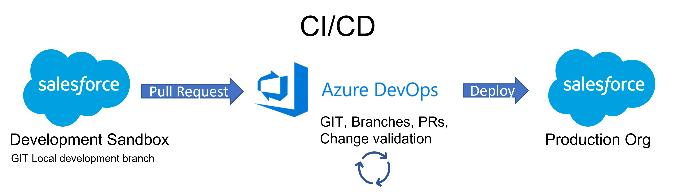
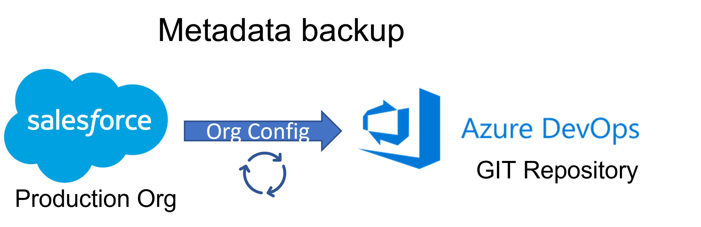

# Salesforce CI/CD And Metadata backup

This project gives you all of the components needed to set up a Salesforce CI/CD flow and Org metadata backup.
This is intended to be used with <b>Azure pipelines</b>.

It uses Ant for deployment and validation.

Docker is used for providing ant and sfdx support to the pipelines.

This readme will walk you through how to configure the CI/CD and a Metadata backup. 

The CI/CD and metadata backup can be used separetly.

<b> If you only want the Metadata backup and want to run it in Docker you can use this Docker file </b>
[Salesforce Metadata backup robot Devcore TFS](https://tfs.devcore.se/tfs/DefaultCollection/Salesforce/_git/salesforce-metadata-backup-robot)

To get started, clone this repo into a new Azure DevOps Repository.
If you're running the pipeline in a private project repo, you will need to request permission to use parallelism in DevOps for the pipelines to work.
You can request this [Here](https://devblogs.microsoft.com/devops/change-in-azure-pipelines-grant-for-private-projects/)

# Salesforce CI/CD

## CI/CD Development Flow

The CI/CD part is used to create a developmentflow that is as follows:

Checkout the main branch to a new branch --> Do your development --> Generate your package XML --> Push package.xml and your force-app to remote --> Create a PR --> PR will validate changes -->
Merge PR --> Changes are deployed to production 

## CI/CD Configuration

Steps to configure Salesforce Pipeline

#### Validate is used for running the validation pipeline.

#### Release is used for running the release to production pipeline.

### Set up Variable Groups

1. Create two variable groups. Library -> Variable Group
2. Name the Groups Validation and Release and add the following variables to both:

- sf.maxPoll = 100
- sf.password = 'your org password'
- sf.username = 'your org username'
- sf.serverurl = 'your login url'
- sf.unpackaged = manifest/package.xml
- targetname = (In the Validation Variable group) -> deployCodeCheckOnly
    (In the Release Variable group) -> deployCode

### Create Validation Pipeline

1. Create a new pipeline
2. select Azure Repos Git
3. Select pipeline repo
4. Select "Existing Azure pipelines YAML file"
5. Choose /pipelines/validation.yaml
6. Click save
7. Edit pipeline -> click three dots next to "Run" (top right corner) -> Triggers
8. Override the YAML continuous integration trigger from here: True
9. Disable continuous integration: True
10. Save

The validation pipeline should only be run when we want to validate a PR, this is why we disable CI here. The validation pipeline runs a check only deployment to the org specified in the Validation variable group.

### Create Build Pipeline

1. Repeat Steps for Validation pipeline, use "Build.yaml" instead.
2. Override the YAML continuous integration trigger from here: True
3. Disable continuous integration: False
4. Branch filters: Include, Branch specification: main
5. Save

The build pipeline now runs each time we merge or push something into the "main" branch. The Build pipeline generates a build artifact that is picked up by the release pipeline.

### Set up release pipeline:

1. Create New Release Pipeline
2. Link variable group "Release". (Variables -> variable groups-> Link)
3. Add a new step "Empty Job" and name it "Production".
4. Add new tasks to the release pipeline
5. Add an "Extract files" Task, name it "Extract Deploy Files".
   1. Archive file patterns = _\*\*/deploy_.zip
   2. Destination folder = deploy
6. Add an "Extract files" Task, name it "Extract Delta Files".
   1. Archive file patterns = _\*\*/deploysource_.zip
   2. Destination folder = deploysource
7. Add an "Ant" Task, name it "Deploy to Production"
   1. Ant build file: deploy/build.xml
   2. Options: -Dsf.password=\$(sf.password) -Dsf.username=\$(sf.username) - Dsf.serverurl=\$(sf.serverurl) -Dsf.maxPoll=\$(sf.maxPoll)
   3. Target(s): deployCode
8. Save
9. Add an artifact
   1. Select build
   2. Make sure that the project is your current project
   3. Source (Build pipeline): Build
   4. Default version: Latest
   5. Source alias: \_Build
10. Check that the Artifact has Continuous integration Enabled. (This will run the release pipeline each time that the Build pipeline produces a new build artifact).

#### Now the Validation, Deploy and Release pipelines should be set up. It's now time to configure our Continous deployment.

In this case we will block all direct merges to Main, and force merges to be made via Pull requests. To manage this we need to set up Branch Policies.  
Read more on branch policies here: - [Azure DevOps Branch Policies](https://developer.salesforce.com/tools/vscode/)

1. Go to Branches, select the main branch press "Branch Policies" (The three dots to the right when hovering the branch name)
2. Now set up the policies that you want to have for your project. If you add 0< policies, merges can only be made via PRs.
3. For demo purposes set the following:
   1. Minimum number of reviewers: 1
   2. Allow requestors to approve their own changes: true
   3. Check for comment resolution: Required.
4. On Build Validation, add the Validation pipeline.
   1. Trigger: Automatic (This will force the validation to re-run each time something is pushed to the PR source branch)
   2. Policy requirement: Required (Validation must pass before the PR can be merged)

### After all CI/CD configurations the following should now be true:

- You should have two pipelines: Validation and Build
- Changes cannot be directly merged to main
- When a PR is created, the validation pipeline should run, and validate to your org
- When a PR is Merged to main, the Build Pipeline should run. On completed Build pipeline the release pipeline should run and deploy your changes to your org.

## How does the pipeline know what I want to deploy?

This is achieved by the validation and build pipeline running the PowerShell script <i>Delta.ps1 </i>.
The delta script is used by the validation and build pipeline to single out the correct files to validate and deploy from your force-app folder.

An imporant file for the Delta script is the .csv file "sfdccomponentslist.csv". This list is maps packageXML file types, to a sourceFormat folder. If a type that you want to deploy is missing, the delta script wont find your change. Add the mapping to this list if it's missing.

In order for the Delta script to work you need to have an updated Package.xml file in your Manifest folder. The package.xml should only include the files that you want to deploy to production.
<b>All files in the package.xml file will be validated, and deployed to production!</b>
Make sure that your package.xml is pushed to your branch.

### Building your package.xml

To make your building of the package.xml file a pain free, and smooth process install the VS Code extension [Package XML Generator](https://marketplace.visualstudio.com/items?itemName=VignaeshRamA.sfdx-package-xml-generator).

## Following the development flow
1. Checkout the main branch to a new branch
2. Do your development
3. Generate your package XML
4. Push package.xml and your force-app to remote 
5. Create a PR
6. PR will validate changes
7. Merge PR
8. Changes are deployed to production

# Salesforce Metadata Backup

The metadata backup pipeline is used in order to keep the force-app folder in the main branch 100% up to date with all changes that are made in your production org. This will give you change history of the metadata changes that both are made directly in the org via Config changes, and those that are made via the CI/CD flow. Cool right?

The pipeline definition is stored in the pipelines directory as <b>metadatabackup.yaml</b>.
The files required for the Metadata backup is stored in the folder <b>Metadata-backup</b>.

<b> If you only want the Metadata backup and want to run it in Docker you can use this Docker file </b>
[Salesforce Metadata backup robot Devcore TFS](https://tfs.devcore.se/tfs/DefaultCollection/Salesforce/_git/salesforce-metadata-backup-robot)

## Setting up the metadata backup

1. Create a new variable group called metadata-backup
2. Add the following variables:

   - GIT_ACCESSTOKEN = 'GIT access token' (How to get one: [Azure DevOps access token](https://docs.microsoft.com/en-us/azure/devops/organizations/accounts/use-personal-access-tokens-to-authenticate?view=azure-devops&tabs=Windows))
   - GIT_EMAIL = 'Some admin email'
   - GIT_NAME = 'Metadata Backup'
   - GIT_REPO_URL = 'Your GIT Repo URL' (Should be in format dev.azure.com/devglyph/Norca%20Space/\_git/SalesforcePipeline (remove orgName@ prefix from the URL) )
   - SF_PASSWORD = 'Your Org Password'
   - SF_SEC_TOKEN = 'Your Sec Token'
   - SF_SERVER_URL = 'Your Login URL'
   - SF_USERNAME = 'Your Salesforce Username'

3. Create a new pipeline
4. select Azure Repos Git
5. Select pipeline repo
6. Select "Existing Azure pipelines YAML file"
7. Pick the metadatabackup yaml definition file
8. Review and save.
9. Link the metadata-backup variable group to the pipeline.

You can now manually run this pipeline to update the main force-app folder with the latest changes made in your org.

To schedule the pipeline to run automatically:

1. Edit pipeline triggers
2. Triggers -> Add scheduled
3. Set your desired runtimes.
4. Save

Read more: [Pipeline Schedules](https://docs.microsoft.com/en-us/azure/devops/pipelines/process/scheduled-triggers?view=azure-devops&tabs=yaml)

### FYI

The folder <b>force-app/main/default/cleanDataServices</b> is not backed up. I removed this due to the xml chaning on each run, resulting in a push on every backup run. If you really want to keep this, just edit the convert-and-push.bash file.

## Conclusion

You now should have a fully functioning CI/CD flow, with a metadata-backup tagged onto it.
If you want to add a pipeline for validation and deplyment to say a UAT org before moving to production, you can achieve that by just cloning the production validation / deployment pipelines and adapting them for a UAT context.

You can either use just hte CI/CD pipelines, or the Metadata-backup pipeline. There is no need to have both if it doesn't fit your project!

### Disclaimer

When running the Metadatabackup together with the CI/CD use caution. If you have the CI/CD set up so that merged changes automatically are pushed to production you could make unintended changes. <b>Always test with a sandbox first!</b>

## Room for improvemet

There's probably a lot.

Some random thoughts:

- Merge metadata backup scripts
- Add all folder/type field mappings to the sfdccomponentslist.csv file.
- Reuse variable groups instead of duplicating some values (such as auth credentials)
